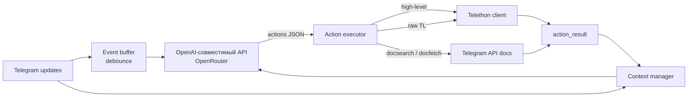

# AiUser

[](https://github.com/shogeoo/AiUser/actions/workflows/ci.yml)


Автономный ИИ-агент, который управляет **реальным аккаунтом Telegram** через [Telethon](https://docs.telethon.dev/).
Агент сам наблюдает события аккаунта, решает, что делать, выполняет действия через Telegram API
(удобный high-level слой и полный raw TL API), анализирует результаты и продолжает цепочку действий.

Модель не пишет Python-код. Каждый её ответ — строго заданный JSON `{"actions": [...]}`, который
проверяется JSON-схемой, а затем исполняется рантаймом.

> ⚠️ **Внимание.** Агент получает полный доступ к аккаунту Telegram: чтение и отправка сообщений,
> работа с чатами, каналами, медиа, профилем, настройками и raw API. Это не песочница.
> Запускайте на отдельном аккаунте, который не боитесь потерять, и сначала прочитайте
> [docs/PROTOCOL.md](docs/PROTOCOL.md) и [docs/ARCHITECTURE.md](docs/ARCHITECTURE.md).

## Возможности

- **События аккаунта**: любые raw-обновления Telegram (сообщения, правки, удаления, прочтения,
  typing, звонки, реакции, service-события и т.д.) в виде структурированных DTO.
- **Строгий structured output**: ответ модели — `{"actions": [...]}` по JSON-схеме, без текста и без tool calling.
- **Два уровня управления**: фиксированный список high-level команд и полный доступ к `telethon.tl.functions.*`.
- **Entity-like значения**: для `InputPeer`/`InputUser`/`InputChannel` можно передавать обычный id, marked id
  или username — Telethon сам резолвит их при выполнении запроса.
- **Медиа**: фото, видео, стикеры, голосовые, документы и аватарки скачиваются и вкладываются в контекст
  модели; отвечать на медиа без его анализа запрещено.
- **Самоанализ**: результаты каждого действия приходят отдельным сообщением; агент исправляет ошибки,
  разбирает частичные результаты (`missing_*`, `failed_*`) и продолжает работу.
- **Runtime-контроль**: сквозные id действий (`a000001`, `a000002`, ...), сквозная история в `context.json`,
  собственные логи в консоль и файлы.

## Как это работает



1. Telethon присылает обновления; они сериализуются в JSON-конверты и копятся в буфере (`EVENT_BUFFER_TIMEOUT`).
2. Буфер отдаёт пачку событий — каждое событие добавляется в контекст **отдельным** user-сообщением.
3. Модель получает контекст и возвращает `{"actions": [...]}` (структура гарантируется `response_format: json_schema`).
4. Executor выполняет действия строго по порядку: high-level команды, raw-запросы, поиск и запрос документации.
5. Результат каждого действия добавляется отдельным сообщением `{"type": "action_result", ...}` в хронологическом порядке.
6. Пункт 3 повторяется, пока модель не вернёт `{"actions": []}` — это значит «ничего не делать».

## Быстрый старт

Требования: Python 3.11+, аккаунт Telegram, ключ OpenRouter.

1. Получите `api_id` и `api_hash` на [my.telegram.org](https://my.telegram.org) → API development tools.
2. Получите ключ на [openrouter.ai](https://openrouter.ai/keys).
3. Установите зависимости и настройте окружение:

```bash
git clone https://github.com/shogeoo/AiUser.git
cd AiUser
python -m venv .venv
source .venv/bin/activate
pip install -r requirements.txt

cp .env.example .env
# заполните TG_API_ID, TG_API_HASH, OPENROUTER_API_KEY
```

4. Запустите агента:

```bash
python main.py
```

При первом запуске Telethon попросит номер телефона, код и (если включена) 2FA-пароль.
Сессия сохранится в `session.session`, повторный вход не потребуется.

## Настройка

Переменные окружения (`.env`):

| Переменная | Назначение |
| --- | --- |
| `TG_API_ID` | `api_id` приложения Telegram |
| `TG_API_HASH` | `api_hash` приложения Telegram |
| `OPENROUTER_API_KEY` | ключ OpenRouter |

Настройки в `src/config.py`:

| Константа | Назначение |
| --- | --- |
| `OPENROUTER_BASE_URL` | база OpenAI-совместимого API (по умолчанию OpenRouter) |
| `MODEL_NAME` | модель, например `google/gemini-3.5-flash-lite` |
| `EVENT_BUFFER_TIMEOUT` | сколько секунд копить события перед отправкой модели |

Промпты:

- `system_prompt.txt` — протокол, правила и описание инструментов агента;
- `person_prompt.txt` — личность, стиль и характер (добавляется к системному промпту).

## Структура проекта

```
main.py                # точка входа
system_prompt.txt      # системный промпт агента
person_prompt.txt      # слой персоны
requirements.txt       # runtime-зависимости
pyproject.toml         # метаданные, dev-зависимости, конфиги ruff и pytest
src/
  assistant.py         # цикл агента, буфер, контекст, сквозные id
  executor.py          # выполнение actions, action_result, медиа
  dto.py               # сериализация/десериализация Telegram DTO
  api_docs.py          # docsearch / docfetch по Telegram API
  schema.py            # JSON-схема ответа модели
  commands.py           # whitelist high-level команд
  events.py            # сериализация событий
  context.py           # история диалога и context.json
  buffer.py            # debounce-буфер событий
  model_info.py        # определение input-модальностей модели
  config.py            # настройки и пути
  logger.py            # консольные и файловые логи
  exceptions.py        # ошибки выполнения
docs/
  ARCHITECTURE.md      # устройство и поток данных
  PROTOCOL.md          # JSON-протокол агента
tests/                 # офлайн-тесты (без сети и Telegram)
```

## Тесты и линт

```bash
pip install -e ".[dev]"
ruff check .
ruff format --check .
pytest
```

Тесты полностью офлайн: сеть, Telegram и OpenRouter не нужны. Интеграционные тесты помечены
маркером `integration` и по умолчанию пропускаются.

## Ограничения

- **Приём звонков не поддерживается.** Raw-методы `phone.*` доступны, но для реального приёма нужен
  E2E DH-обмен ключами и медиаслой (WebRTC/RTP), которых в проекте нет. Наблюдать звонок, пометить
  `ReceivedCall` или отклонить его агент может.
- **Нет автоматических лимитов** на количество итераций, время ожидания и размер вложений —
  все решения о темпе принимает модель.
- **Контекст не обрезается**: история растёт, пока не удалить `context.json`.
- Модель может ошибаться: агент умеет запрашивать документацию (`docsearch`/`docfetch`) и исправляться,
  но гарантий корректности нет.

## Лицензия

[MIT](LICENSE) © 2026 Georgiy
